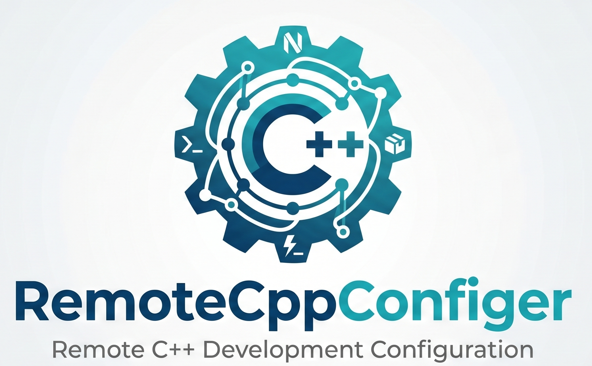

<p align="center">
  
</p>

# RemoteCppConfiger

Out-of-the-box C++ development environment for a raw Linux box. One install script lays down a Neovim-based editor, an LLVM toolchain, gcc-12 (apt or Spack), Rust, Node, and a curated set of CLI tools — all under `$HOME/local`.

Designed to work on hosts with **or without** sudo. The only thing that branches is how gcc-12 is acquired; everything else installs identically.

## What you get

- **Editor**: Neovim (latest) + an NvChad-derived config tuned for C++, MPI, CMake.
- **C++ toolchain**: gcc/g++ 12 (apt or `spack install gcc@12`), plus prebuilt LLVM 18.1.8 (clangd, clang-format, clang-tidy, libomp).
- **Package manager**: Spack, with gcc-12 registered as the external compiler.
- **LSPs**: clangd, pyright, lua-language-server, html, css.
- **CLI**: ripgrep, fd, bat, eza, zellij, ast-grep, stylua, tree-sitter, lazygit, yazi.
- **Terminal multiplexer**: Oh My Tmux config (Nord theme, mouse on, TPM with `tmux-sensible` and `tmux-pomodoro-plus`).
- **Languages**: Rust (rustup), Node 22, Python 3 (system).

## Quick start

Clone anywhere and symlink the editor config into `~/.config/nvim`:

```bash
git clone <this repo> ~/code/RemoteCppConfiger
ln -sfn ~/code/RemoteCppConfiger/nvimconfig ~/.config/nvim
```

(If `~/.config/nvim` already exists, back it up first: `mv ~/.config/nvim ~/.config/nvim.bak.$(date +%s)`.)

### Linux (Ubuntu 22 / 24)

```bash
cd ~/code/RemoteCppConfiger/ubuntu_install_scripts
./install_all.sh
```

For the no-sudo path, see [`docs/install.md`](docs/install.md).

### Mac (Apple Silicon, Homebrew)

```bash
cd ~/code/RemoteCppConfiger/macconfig
./install_all.sh
```

Prerequisites: [Homebrew](https://brew.sh), Xcode Command Line Tools (for `git`).

Then launch:

```bash
nvim
```

## Documentation

- [`docs/install.md`](docs/install.md) — full install walkthrough (sudo and no-sudo paths)
- [`docs/design.md`](docs/design.md) — architecture and trade-offs
- [`docs/troubleshooting.md`](docs/troubleshooting.md) — known issues and fixes
- [`docs/usage.md`](docs/usage.md) — keymap and snippet reference

## Layout

```
RemoteCppConfiger/                 # cloned anywhere
├── nvimconfig/                    # → ~/.config/nvim (via symlink)
├── ubuntu_install_scripts/        # Linux installer (Ubuntu 22 / 24)
├── macconfig/                     # Mac installer (Brewfile + scripts)
├── shared/
│   ├── tmux/                      # tmux.conf.local (both platforms)
│   └── shell_rc/                  # one zsh+bash template, per-platform paths
└── docs/
```

Linux installs into `$HOME/local/` and `$HOME/spack/`. Mac uses Homebrew's prefix (`/opt/homebrew`) plus `$HOME/spack/`.

## Credits

Built on [NvChad](https://github.com/NvChad/NvChad). Inspired by the [LazyVim starter](https://github.com/LazyVim/starter).
